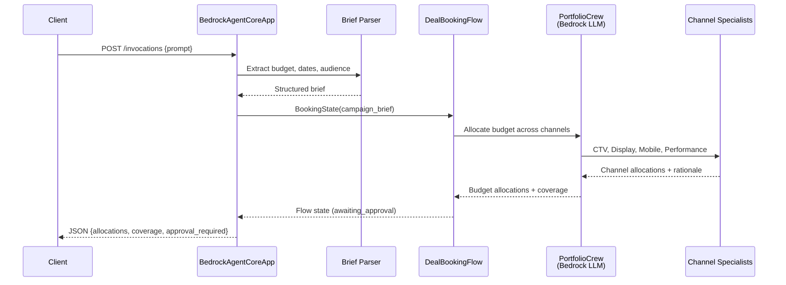

# AgentCore Architecture

The AgentCore deployment wraps the existing `DealBookingFlow` and `ChatInterface` in a `BedrockAgentCoreApp` container. All AgentCore-specific files live in `src/ad_buyer/interfaces/agentcore/` and `patches/`.

---

## Design Principles

1. **No community code modifications** — Flow, crew, and pipeline code is untouched. The AgentCore entrypoint calls `DealBookingFlow` directly.
2. **Single responsibility** — The buyer runtime handles campaign planning only. Seller interactions are handled by the seller runtime.
3. **Structured output** — Returns JSON with budget allocations, audience coverage, and approval status. Formatting is left to the caller.

---

## Component Map

```
src/ad_buyer/interfaces/agentcore/
├── http_main.py          # BedrockAgentCoreApp entrypoint
├── crew_tools.py         # DealBookingFlow wrapper + brief parsing
├── http_entrypoint.py    # Alternative entrypoint (legacy)
└── __init__.py

patches/
├── crewai_bedrock_fix.py # Bedrock Converse API compatibility
└── __init__.py

infra/aws/agentcore/
├── deploy.sh             # Build + deploy via agentcore CLI
└── requirements.txt      # Python dependencies for container
```

---

## Data Flow



---

## Relationship to ECS Deployment

| Aspect | ECS/Docker | AgentCore |
|--------|-----------|-----------|
| LLM provider | Anthropic API | Bedrock Converse |
| Seller communication | Direct HTTP to seller URL | Separate runtime (orchestrated externally) |
| Storage | PostgreSQL + Redis | SQLite in-memory |
| Deploy tool | Docker Compose / CloudFormation | `agentcore` CLI |
| Code changes | None | `interfaces/agentcore/` + `patches/` only |
